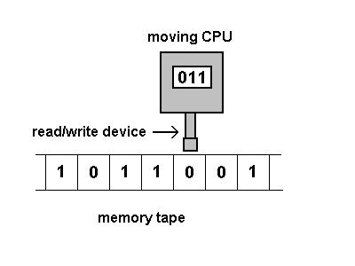

# Turing Machine
This project is a turing machine simulator. 

<ins>Wikipedia</ins> :
_The Turing Machine is a machine that operates on an infinite memory tape divided into discrete cells, each of which can 
hold a single symbol . It has a "head" that, at any point in the machine's operation, is positioned over one of these 
cells, and a "state" . At each step of its operation, the head reads the symbol in its cell. Then, based on the symbol 
and the machine's own present state, the machine writes a symbol into the same cell, and moves the head one step to the 
left or the right, or halts the computation._

<p align="center">
  
  <br />
  <i>the head read the tape, write and move the tape</i>
</p>

Project based on : 
- https://morphett.info/turing/turing.html
- https://www.youtube.com/watch?v=ivPv_kaYuwk

## Execution
to start the program execute the `main.py` file. 
- Windows
```bash
python main.py
```
- MacOS & Linux
```bash
python3 main.py
```

## How it works 

The Turing machine will always start at the state named `0`.

`[state] [current symbol] [new symbol] [direction] [new state]`

- **state** correspond to the name of the state.
- **current symbol** correspond to the symbol that as to be readed on the tape to continue this line.
- **new symbol** is the symbol that will be written on the tape if the current symbol match with the tape. 
- **direction** is the direction the head on tape as to be moved. 
- **new state** is the next state that the machine as to execute.

example : 
```turing
0 0 1 r 0 ; if it read 0 on the tape, write 1 and then go to the right.
0 1 0 r 0 ; if it read 1 on the tape, write 0 and then go to the left.
0 * _ * halt ; if it read neither of 1 and 0, stay here and stop.
```
## Use your own program
You can put your own program in the `main.tur` file.

<ins>How to program</ins> : <br />
Every line has to be in the right format :
`[state] [current symbol] [new symbol] [direction] [new state]`
- `[state]` and `[new state]` :
  - Can be anything (number and letter) but semicolon, and space.
  - To stop the program, use the halt state.


- `[current symbol]` and `[new symbol]` :
  - use **_** to read and write **space**.
  - use * to read anything or **write nothing**.
  - you can't use ;


- `[direction]` :
  - use **r** to go **right** on the tape.
  - use **l** to go **left** on the tape.
  - use * to **not move**.
  - you can't use ;

**You can use ; to put comment in your program.**

## Tweaks
You can modify which file will be executed or change the first state in the `main.py` file.

```python
FILE_PATH = 'main.tur' # Change the file path that the program will execute here.
FIRST_STATE_NAME = '0' # Change the name of the first state that will be executed here.
```

You can also enable the debug mode by modifing the `fonctions/main_fonction.py` file.
```python
DEBUG = False # Set this to True if you want to turn on the debug mode.
```
This will slow down the execution to one state every 25 milliseconds and print every action that your Turing program will do on the tape like this : 
```
┌─ Started execute state : ──────────────────────────────────────────────
│ • [current_state] = 0
│ • [tape] = [101]
│             ↑
│ • [execute] Writing _ at location 1 and go to r
└─ Ended execute state ──────────────────────────────────────────────────
```
## Licence
- romainflcht